<div align="center">
  
</div>

<div align="center">

`reverse engineer` &nbsp;·&nbsp; `web` &nbsp;·&nbsp; `automation` &nbsp;·&nbsp; i take things apart to see how they work

</div>

---

### `▚` imports resolved

| symbol | linked from | purpose |
| :-- | :-- | :-- |
| **Go** | `backend` | fast services, converters, tooling |
| **JavaScript** | `web` | frontends, obfuscation, scraping |
| **Python** | `scripts` | automation, glue, quick RE |
| **Ghidra · x64dbg** | `re` | disassembly, unpacking, protocol extraction |

### `▚` currently reversing

> **[Morphix](https://github.com/brokengg4/morphix)** — a file converter that looks simple and isn't.
> Go + ffmpeg engine, obfuscated frontend, Cloudflare-fronted, origin-locked.

### `▚` field notes

```text
> stack ............. Go · JavaScript · Python
> toolkit .......... Ghidra · x64dbg · Wireshark · Burp
> natural habitat .. devtools, disassembly, 3am
> current quest .... making the web do things it wasn't asked to
```

<div align="center">
<br>
<sub><i>the best documentation is the binary itself.</i></sub>
</div>
